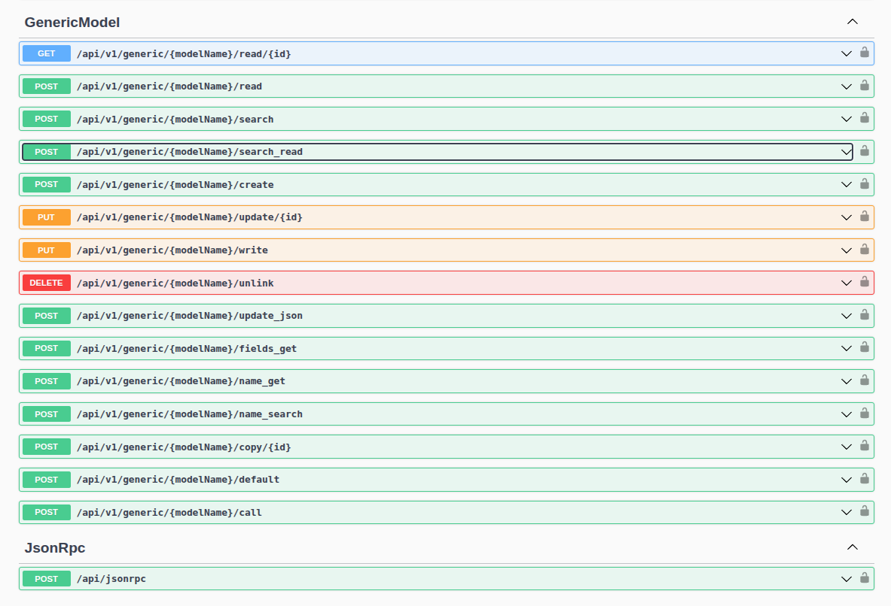
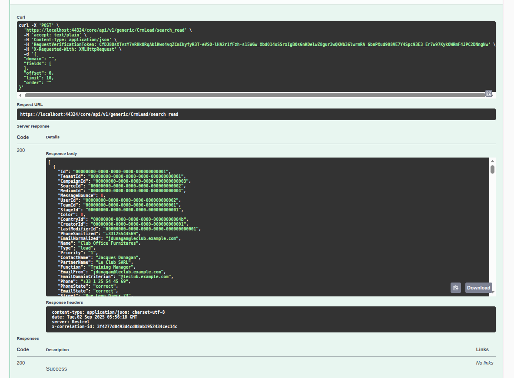
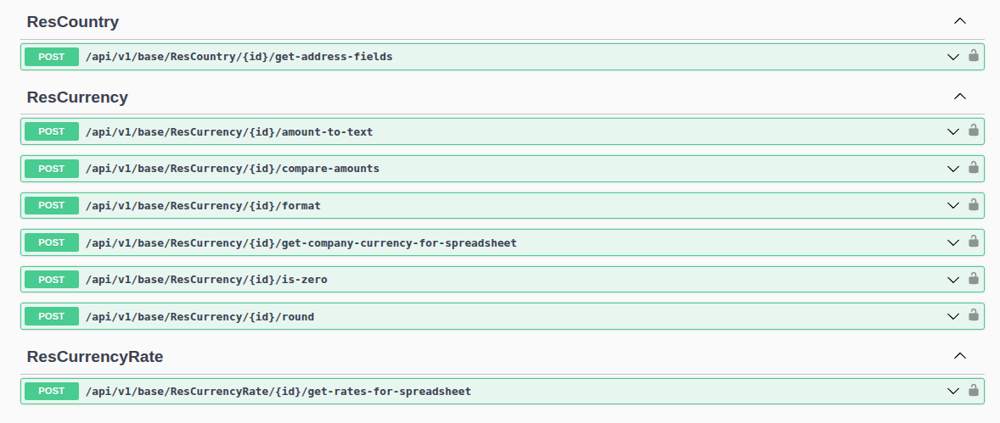
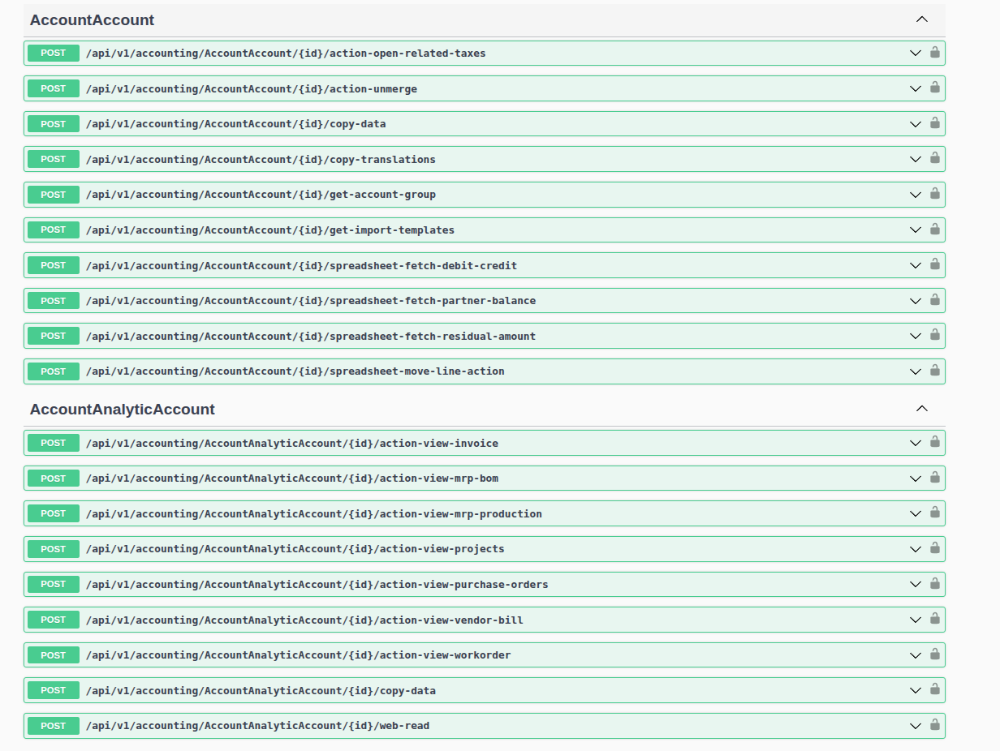
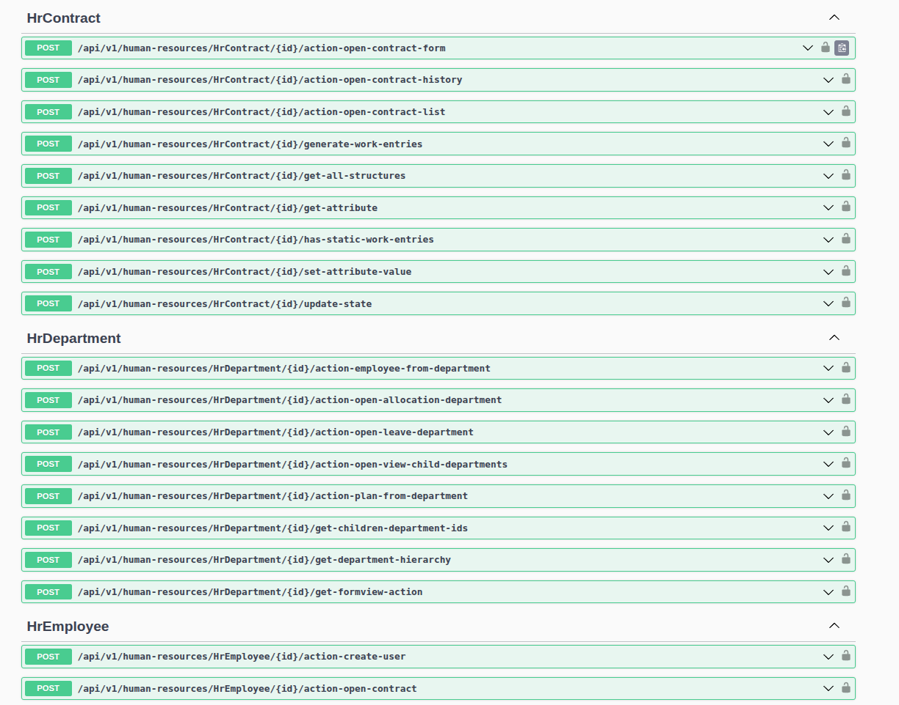

# Bamboo ERP

**Bamboo** is a porting of **Odoo ERP** to C# using ABP Framework.

# Features

- **ABP** version v10.0
- **Microservices**.
- **Scripts and config to migrate data from odoo to bamboo**.
- **Odoo 18-19 porting**:

  - **Entities**: **> 500 entities** converted from Odoo database, with near full modules.
  - **Id** fields: Converted from **int** to **uui** PostgreSQL data type (all.)
  - **ResCompany**: mapped to **Tenant**
  - **ResUser**: mapped to **IdentityUser**

- Use same model objects for entities and dtos. **All models/entities** were placed in folder **Bamboo.Core.Domain.Shared/Models**
- **Basic Generic API**
- **JsonRpc**

# Generic API and JsonRpc

**Generic APIs allow call Odoo-style APIs.**



## Generic API in action



# Skeleton APIs

**Skeleton API export only entries without implement bussiness logic.**







# No more support

All these features will be replace with `Generic API`:

- **Full CRUD** for every models.
- **AppContracts / AppServices / AppControllers / AppClientProxies for every models.** Auto generated by internal **CodeGen**.

# Migration Guide

I create a migration guide in [docs/migrate-odoo-uuid.md](docs/migrate-odoo-uuid.md)

# How to run

## Docker compose

- Build

```
dotnet ef migrations add Initial --startup-project services/core/host/Bamboo.Core.HttpApi.Host/Bamboo.Core.HttpApi.Host.csproj --project services/core/src/Bamboo.Core.EntityFrameworkCore/Bamboo.Core.EntityFrameworkCore.csproj --context CoreDbContext

./script/build.sh
```

This will build all relate project to `bin` directory.

- Update config files and environments

```
vi .env
```

- Run

```
docker compose up -d
```

- Create databases

```
./scripts/db-create-admin-db.sh
./scripts/db-create-core-db.sh
```

- Init admin database

```
docker exec -it bamboo-admin dotnet /app/Bamboo.Admin.DbMigrator.dll
```

- Init core database

```
docker exec -it bamboo-core dotnet /app/Bamboo.Core.DbMigrator.dll
```

- Migrate data from odoo-18 to bamboo

```
./scripts/pgloader/run-data-odoo18.sh
```

## Run with VS Studio

1. Open **Bamboo.Admin.sln** then build and run **Bamboo.Admin.HttpApi.Host** for login / account management
2. Open **Bamboo.Core.sln** then build and run **Bamboo.Core.HttpApi.Host** for CRUD services
3. Open **Bamboo.Web.MVC.sln** for UI

# TODO - Working in progress

- **UI Generation from odoo xml/database**
- **Report Generation from odoo xml/database**
- **Bussiness Logic**.
- **Localization**
- **Web UI App** (MVC or Blazor / Angular)
- **Mobile App**

# Contribute

Please fork, create your own branch, update code then make pull request.

Thanks.

# Other

Please **free** to contact me at ha@dad.vn if you can help.
